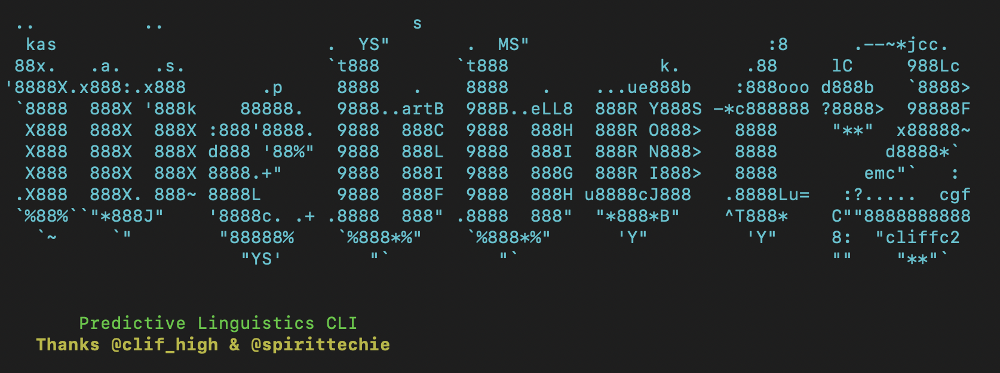

# WebBot 2.0 CLI



A Python CLI tool for predictive linguistics analysis using the methodology pioneered by clif high (1993).

**WebBot 2.0** scrapes web content, analyzes for predictive patterns using LLM, and generates reports detecting "future leaks" - time-displaced content ahead of its time.

---

## Quick Start

### 1. Install
```bash
pip install -e .
```

### 2. Run Interactive Menu
```bash
./start-webbot2.sh
```

---

## Main Menu

```
  [1] Web Scraper          (Scrapy - fetch any URL)
  [2] Analyze Local File  (PDF/MD/JSON → report)
  [3] View Results        (browse output folder)
  [4] Configuration       (API keys, settings)
  [5] Timeline Tracker    (batch analyze → timeline view)
  [0] Exit
```

---

## Features

### Web Scraper (Scrapy)
- Single URL scraping with any website
- Quick presets: Hacker News, Reddit, BBC, Wired, Ars Technica
- Extract all links from a page

### News Sources
- **Currents API** - 600 requests/day (recommended)
- **NewsAPI** - 100 requests/day
- RSS feeds fallback (BBC, Reuters, AP, NPR)

### LLM Analysis (OpenRouter)
Free tier models available:
- `minimax/minimax-m2.5:free` (recommended - balanced)
- `nvidia/nemotron-3-super-120b-a12b:free` (largest, slowest)
- `google/gemma-3-4b-it:free` (fast)

---

## Predictive Linguistics Methodology

Based on clif high's original WebBot (1993-2010):

### Entity Categorization
- **GlobalPop** - Humanity's future, local or global
- **Markets** - Paper debt, commodities, currency, digital currency
- **Terra** - Planet/physical environment
- **SpaceGoatFarts** - Officially denied, unknown, speculative (UFOs, Area 51)

### Prediction Timeframes
- **IM (Immediacy)**: 3 days to 3 weeks
- **ST (Short Term)**: 4 weeks to 3 months
- **LT (Long Term)**: 3 months to 19 months

### Analysis Output
- Temporal anomalies (time-displacement detection)
- Memetic lifecycle stages (Awareness → Excitement → Momentum → Critique → Integration → Nostalgia)
- Archetypes (Catalyst, Herald, Shapeshifter, Shadow, Wise Elder, Trickster, Innocent, Warrior)
- Future leak indicators with confidence scores

---

## Commands

### Scrape News
```bash
webbot2 scrape news --query "technology" --limit 50
```

### Scrape Reddit
```bash
webbot2 scrape reddit --subreddit all --query "AI" --limit 25
```

### Analyze
```bash
webbot2 analyze llm data.json --prompt-type webbot
```

### Generate Report
```bash
webbot2 report markdown analysis.json --output report.md
```

---

## Configuration

Create `~/.webbot2.env`:
```bash
# OpenRouter (free)
OPENROUTER_API_KEY=sk-or-...

# News API (optional)
CURRENTS_API_KEY=your_key
NEWSAPI_KEY=your_key
```

---

## Output

Results saved to `~/.webbot2/output/`:
- `analysis.json` - Structured analysis
- `report.md` - Markdown report

---

## Requirements

- Python 3.10+
- Dependencies: click, httpx, python-dotenv, beautifulsoup4, scrapy

---

## License

MIT - Based on original WebBot methodology by clif high
